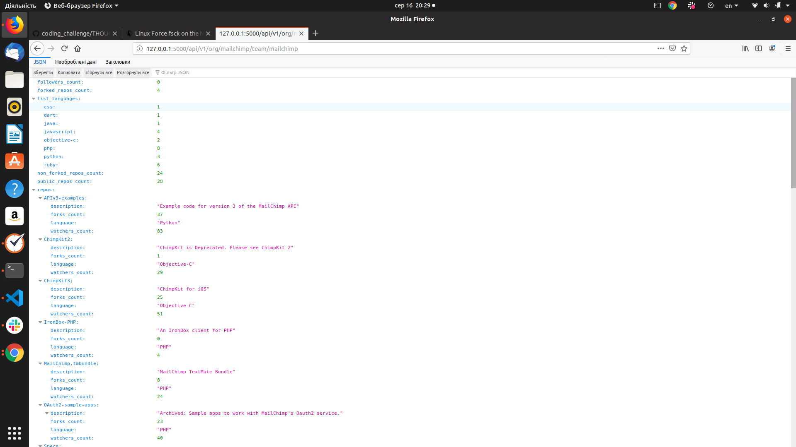

# Coding Challenge App

A skeleton flask app to use for a coding challenge.

## Install:

You can use a virtual environment (conda, venv, etc):
```
conda env create -f environment.yaml
source activate user-profiles
```

Or just pip install from the requirements file
``` 
pip install -r requirements.txt
```

## Running the code

### Spin up the service

```
# start up local server
python -m run 
```

### Making Requests

```
curl -i "http://127.0.0.1:5000/health-check"

curl -i "http://127.0.0.1:5000/api/v1/org/mailchimp/team/mailchimp"
```

Here you will get something like that



# What are the next improvements?

See [my thoughts](/THOUGHTS.md)